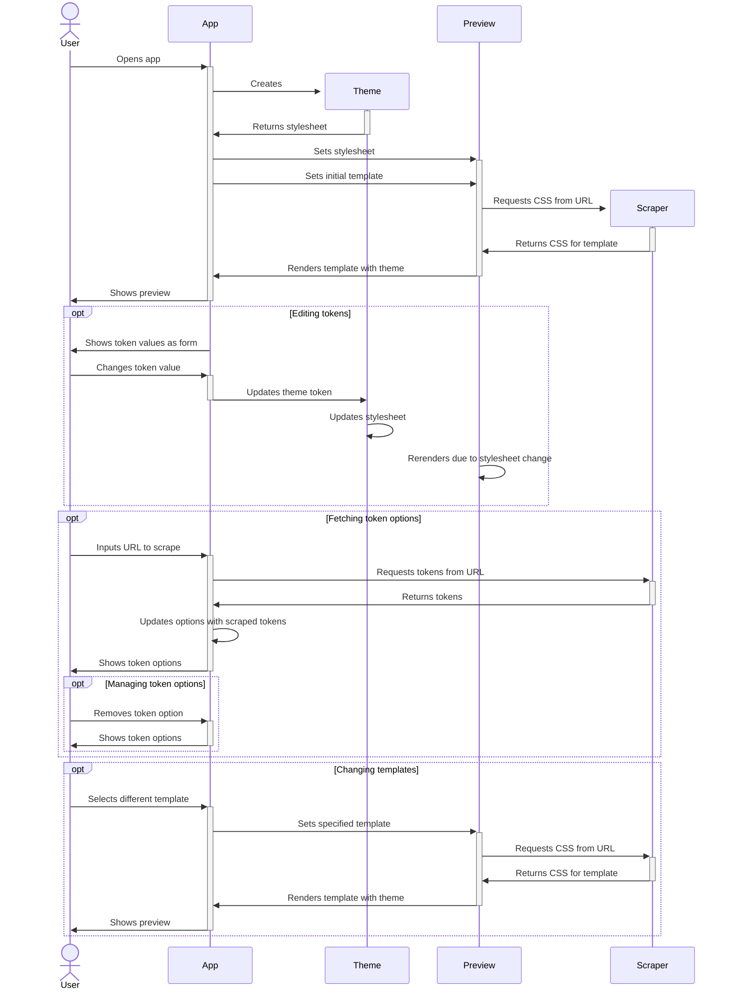
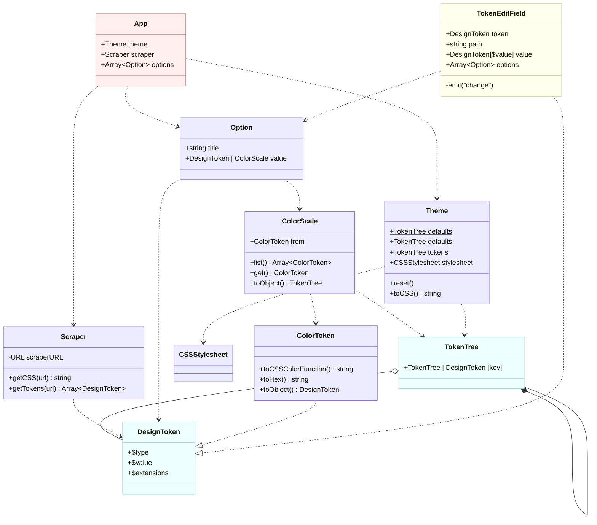

# Application Design

Theme Wizard allows users to create their own NL Design System themes.
It does this by loading in an [https://github.com/nl-design-system/themes/tree/main/packages/start-design-tokens](existing tree of design tokens).

## Sequence Diagram

## Class Diagram

> [!IMPORTANT]  
> This diagram is under development

